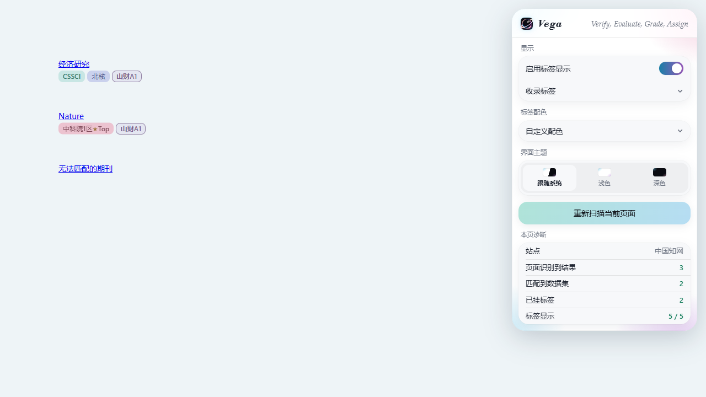

# Vega · 期刊收录标签

当前版本 **v1.3.0**。

[下载安装包](https://github.com/StarfieldAstra/vega-journal-tags/releases/latest/download/vega-journal-tags-v1.3.0.zip) · [发布页](https://github.com/StarfieldAstra/vega-journal-tags/releases/latest)

在知网、Web of Science、Google 学术、百度学术、ScienceDirect、PubMed、Springer、Semantic Scholar 和山西财经大学 WebVPN 的知网结果页旁显示期刊标签。

后续只维护一套包含山西财经大学级别的版本，自用与 GitHub 对外发布使用同一份代码和安装包。支持 CSSCI、CSCD、北大核心、中科院分区、预警期刊和山财级别，六类标签可分别关闭。

点击标签查看详情；山财 A1、A2、A3、A4、B1 可以点选或升降一级，修改保存在本机，刷新后保留。A1、A2 来自学校目录，A3、A4、B1 中的推断级别会明确标注，不应视为学校最终认定。数据共 24,354 条，含山财级别 2,261 条。

界面采用完整圆角浮层，右侧格言为一行 *Verify, Evaluate, Grade, Assign*。仅显示自定义配色入口，默认使用清新配色，保留 18 个颜色位供后续标签扩展。浏览器受限页面打开独立设置页。

安装方法见 [INSTALL.md](INSTALL.md)，数据与权限说明见 [PRIVACY.md](PRIVACY.md)，更新说明见 [RELEASE_NOTES.md](RELEASE_NOTES.md)。

开发：`node validate.js`、`node test_judge.js`、`node test_sites.js`。装有 Playwright 与 Edge 的环境运行 `node test_extension.js` 和 `node test_settings.js`，使用隔离浏览器配置和模拟网页，不读取用户登录信息。`python build_release.py` 生成安装包、源码包与 SHA256 校验文件；可用 `--output-dir` 指定目录。构建脚本拒绝覆盖同版本压缩包。

许可：MIT；期刊目录的权利归原发布机构，使用时请核对原机构最新认定。
